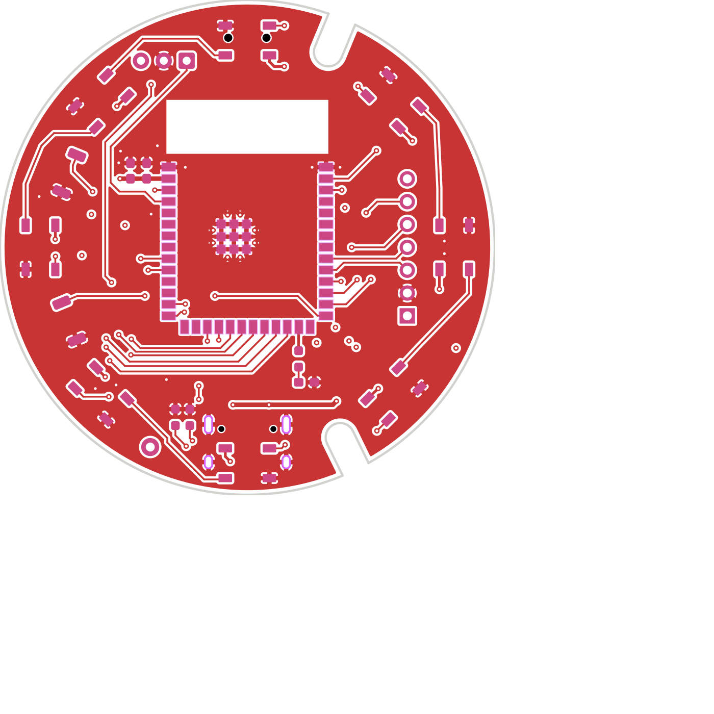

# Newsheen

An **ESP32-S3 LED controller board** and 3D-printed base that turn a translucent 130 mm silicone
lamp into a smart RGB light — 8 addressable LEDs, an IR remote, USB-C, and an optional LoRa radio.

This repo carries the **3D files, the pinout, and firmware** so you can print the base, assemble a
board, and light it up. (KiCad design sources are kept in a separate private repo.)



## What's here

```
hardware/
  pinout.md                    basic GPIO map + build notes
  3d/board/                    board 3D models (STL) — for enclosure/fitment design
  3d/printed-base/             the 3D-printed base: base + button + retaining ring (v4)
firmware/
  simple-led-remote/           offline IR-remote LED controller (source + ready-to-flash factory bin)
  recipes/wledkitty.md         full firmware: WLED + audio-reactive + IR + Wi-Fi web UI
```

## Quick start

1. **Print the base** — `hardware/3d/printed-base/` (base + button + retaining ring, v4). Drop in a
   `98455A367` internal retaining ring (STEP included for reference).
2. **Assemble** — seat the board, connect USB-C. See `hardware/pinout.md` for the IR-receiver and
   LED build notes.
3. **Flash** the simple LED remote:
   ```bash
   esptool --chip esp32s3 write-flash 0x0 firmware/simple-led-remote/dist/newsheen-simple-led-remote.factory.bin
   ```
4. **Point the 21-key IR remote** and press a button — colors, white, brightness ±, effects, on/off.
   Firmware details: `firmware/simple-led-remote/README.md`.

## Firmware

Two ways to run the puck:

- **Simple LED Remote** (above) — tiny, offline, no Wi-Fi. Point the 21-key remote and go.
- **WLEDkitty** — the full experience: the 8 LEDs are **sound-reactive** through the onboard I²S
  mic, the same IR remote works, and you get the complete WLED web UI over a built-in Wi-Fi AP.
  Boots into the Freqwave audio visualizer. Browser-flash it at
  **[scriptkitty.sh](https://scriptkitty.sh)**, or see
  [`firmware/recipes/wledkitty.md`](firmware/recipes/wledkitty.md).
- **[Newsheen Radio](https://github.com/RetiaLLC/NewsheenRadio)** — turns the puck into an
  internet radio. Streams MP3 and AAC over HTTP and HTTPS, searches tens of thousands of
  stations, and plots them on a globe you can spin and tap to tune. The 8 LEDs run 15 effects,
  4 of them driven by a live frequency analysis of the audio. Requires a **MAX98357A amplifier
  and speaker wired to the J3 header** (see that repo for the pinout). Browser-flash it at
  **[scriptkitty.sh](https://scriptkitty.sh/#newsheen)**.

## Board at a glance

- **ESP32-S3-WROOM-1**, 16 MB flash / 2 MB PSRAM (N16R2), native USB-C
- **8× WS2812B** addressable LEDs (GPIO16, via a 5 V level shifter)
- **IR receiver** (VS1838B) on GPIO4
- User button, status LED, sensor/mic header (I²C + I²S)
- Optional **LoRa** (Seeed Wio-SX1262)

Full map: [`hardware/pinout.md`](hardware/pinout.md).

## License

Hardware/3D files: CC BY-SA 4.0. Firmware: MIT. © RetiaLLC.
